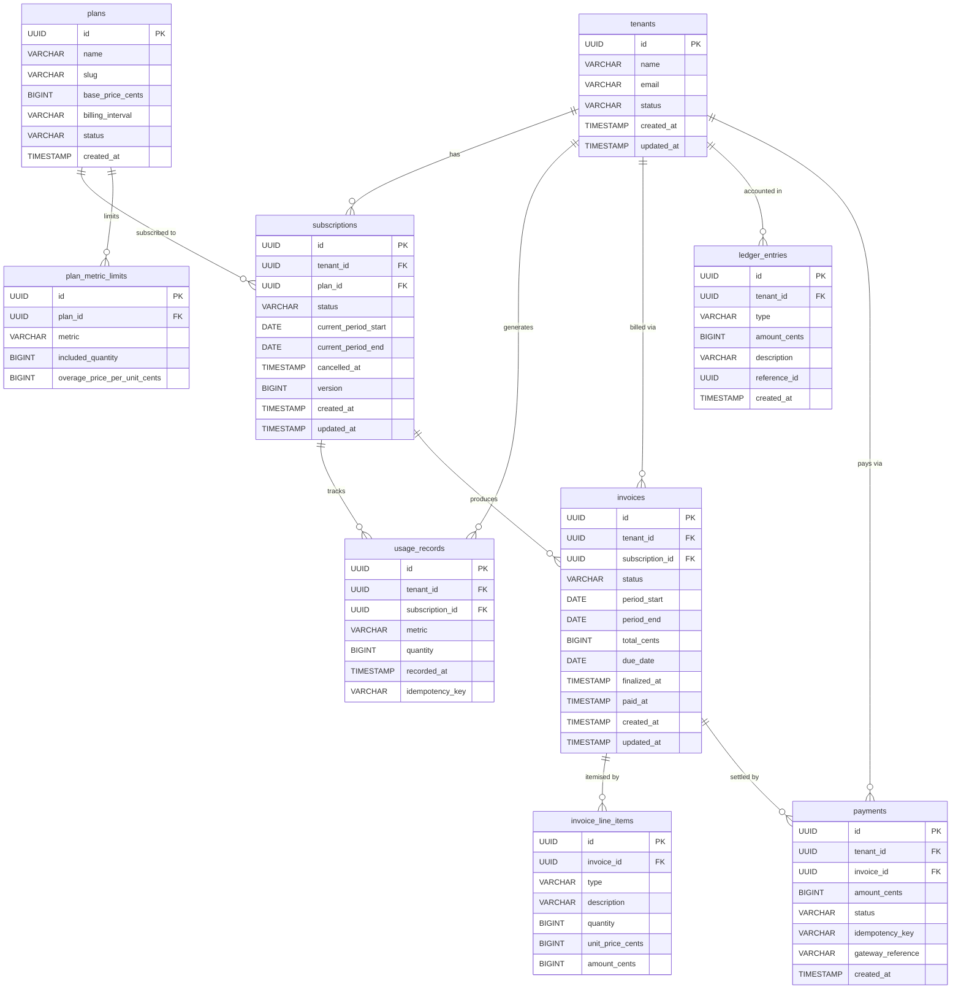
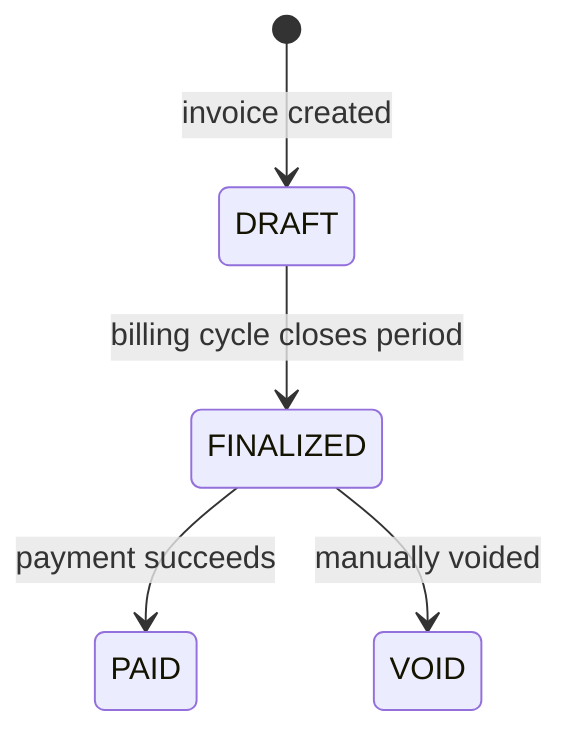
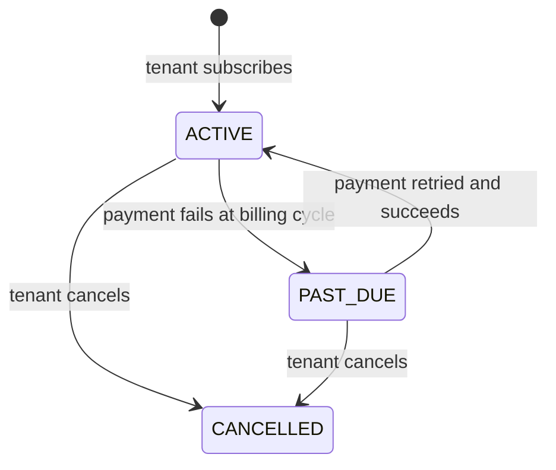
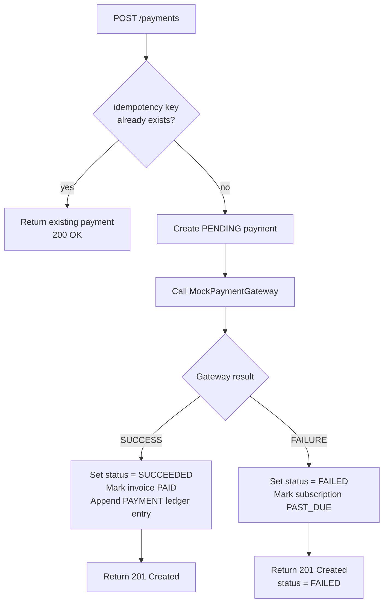

# Billing API

A multi-tenant SaaS subscription billing REST API built with Spring Boot 3.5 and Java 21.


## Tech Stack

| Layer | Choice |
|---|---|
| Language | Java 21 |
| Framework | Spring Boot 3.5 |
| Database | PostgreSQL 16 |
| Migrations | Flyway |
| ORM | Spring Data JPA + Hibernate |
| Mapping | MapStruct |
| Scheduled jobs | Spring @Scheduled + ShedLock |
| Docs | springdoc-openapi 2.x (OpenAPI 3.0) |
| Tests | JUnit 5 + Mockito + Testcontainers |
| Build | Maven |

## Domain Model

### Entity-Relationship Diagram



### Invoice Lifecycle



### Subscription Lifecycle



### Payment Flow



### Billing Cycle Flow

```mermaid
flowchart TD
    A[BillingCycleService\n@Scheduled daily] --> B[ShedLock acquires lock]
    B --> C[Find subscriptions where\ncurrent_period_end <= today\nstatus = ACTIVE or PAST_DUE]
    C --> D{For each subscription}
    D --> E[Aggregate usage records\nfor the period]
    E --> F[Build DRAFT invoice\nbase fee + overage line items]
    F --> G[Finalize invoice]
    G --> H[Attempt payment\nvia gateway]
    H --> I{Payment result}
    I -- SUCCESS --> J[Roll period forward\ncurrent_period_start = today\ncurrent_period_end = today + 1 month]
    I -- FAILURE --> K[Mark subscription PAST_DUE\nleave period unchanged]
    J --> D
    K --> D
```

## Key Design Decisions

**1. Append-only ledger**
Every financial event (payment, refund, proration credit) is a new row in `ledger_entries`. Balance is computed as `SUM(amount_cents)` — no cached column that can drift. This mirrors standard accounting systems: you never edit history, you only append. The audit trail is free.

**2. Idempotency pattern — pre-check, not try/catch**
Before inserting a payment or usage record, the service calls `findByIdempotencyKey`. If a row already exists, it returns it immediately. The alternative — catching `DataIntegrityViolationException` on the unique constraint — does not work with Spring's transaction management: the exception marks the current transaction as rollback-only, so no further writes can succeed in that transaction boundary.

**3. Proration math — integer arithmetic, biased toward the customer**
When a tenant changes plan mid-period, the credit for the old plan uses `Math.floorDiv(oldPrice × remainingDays, daysInPeriod)` (floor — favors the customer), and the charge for the new plan uses `Math.ceilDiv(newPrice × remainingDays, daysInPeriod)` (ceil — protects revenue). All amounts stay in integer cents with no floating-point rounding errors.

**4. ShedLock — distributed job locking over JDBC**
The daily billing job runs on every app instance. ShedLock ensures only one instance executes it at a time by acquiring a row-level lock in the `shedlock` table using the existing PostgreSQL connection. No external coordinator (Redis, Zookeeper) needed.

**5. Partial unique index on subscriptions**
```sql
CREATE UNIQUE INDEX subscriptions_one_active_per_tenant
    ON subscriptions (tenant_id)
    WHERE status = 'ACTIVE';
```
A plain `UNIQUE(tenant_id)` would block a tenant from resubscribing after cancellation. The `WHERE status = 'ACTIVE'` predicate allows unlimited historical `CANCELLED` rows while enforcing the one-active-subscription business rule at the database level.

**6. @Lazy self-proxy in BillingCycleService**
`processTenant()` is annotated `@Transactional`. Calling `this.processTenant()` bypasses Spring AOP entirely — the proxy is never in the call chain, so no transaction is created. The service injects itself via `@Lazy` so each per-tenant call goes through the proxy, giving every tenant its own isolated transaction. A failure for one tenant rolls back only that tenant's work.

## How to Run Locally

```bash
git clone https://github.com/ecrent/billing-api.git
cd billing-api
cp .env.example .env
docker compose up
```

Swagger UI: http://localhost:8080/swagger-ui.html

## How to Run Tests

```bash
./mvnw verify
```

Requires Docker — Testcontainers spins up PostgreSQL automatically.

## What's Intentionally Excluded

- **Real payment gateway** (Stripe/Braintree) — billing logic is the showcase
- **Authentication** — JWT arrives in the next portfolio project; this API uses `X-Tenant-ID` header
- **Email notifications**
- **Yearly billing intervals**
- **Refund endpoints** (ledger supports `REFUND` type structurally)
- **Plan creation via API** (plans seeded via Flyway)

## Live API

https://billing-api.ecren.dev/swagger-ui.html
