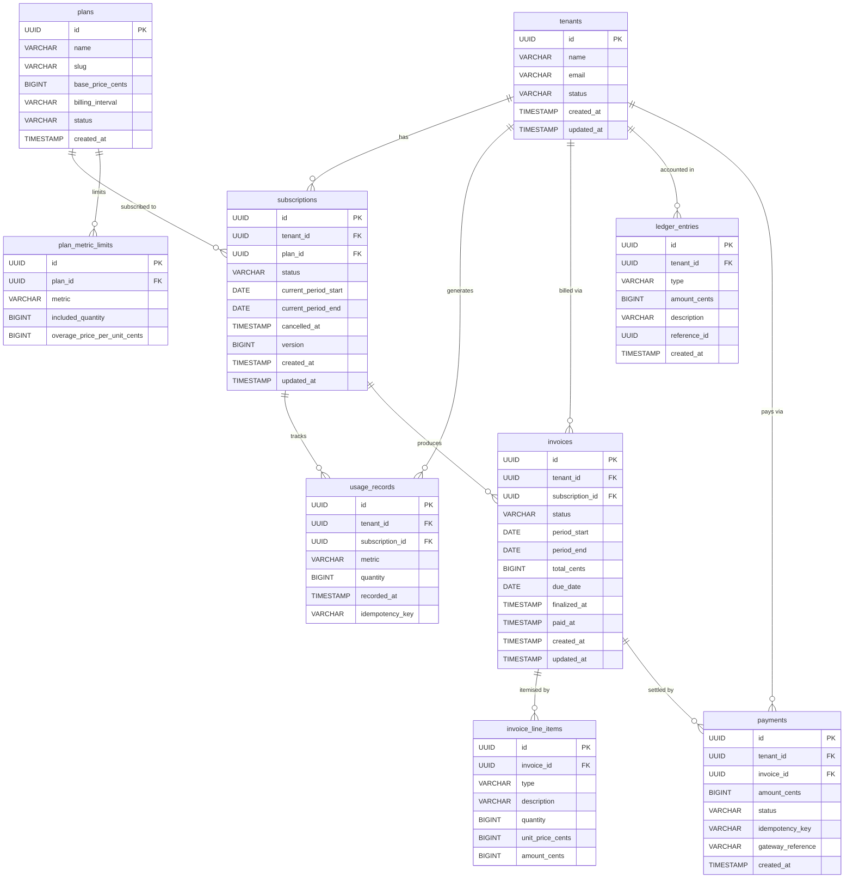
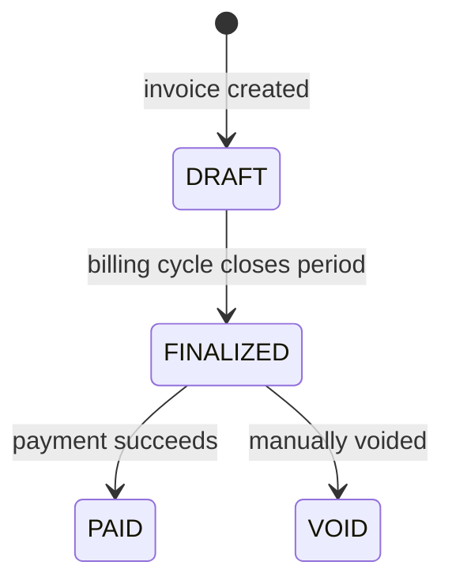
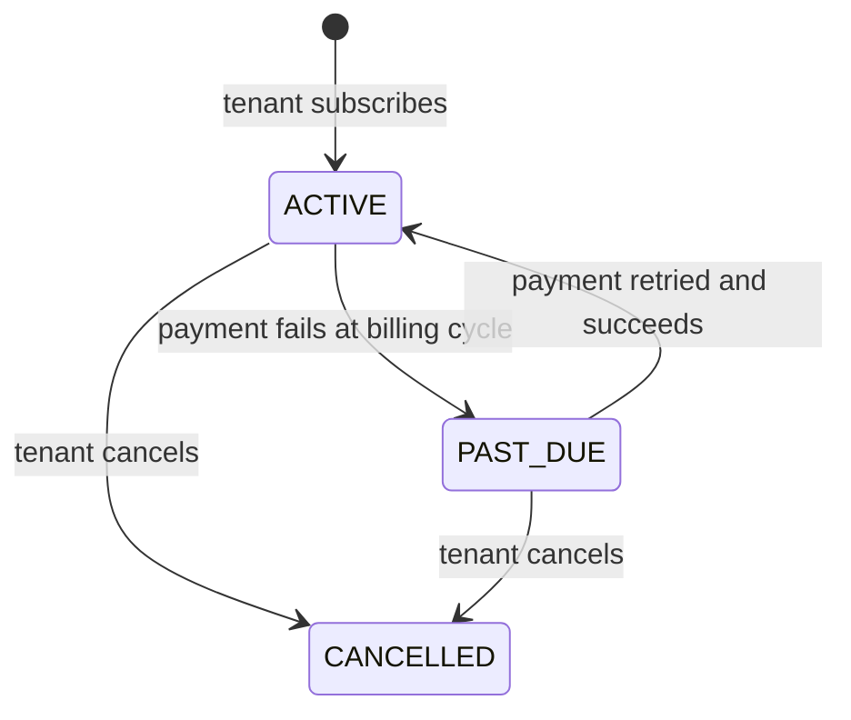
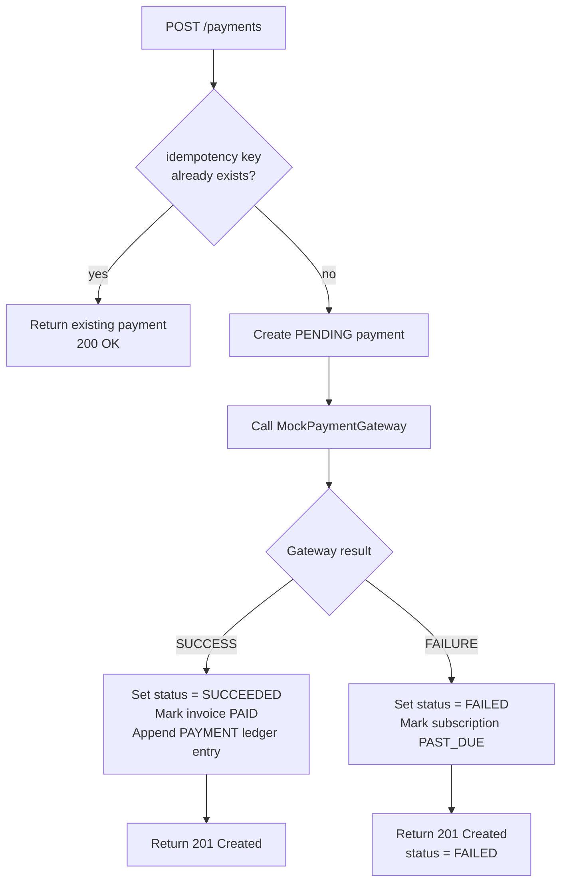
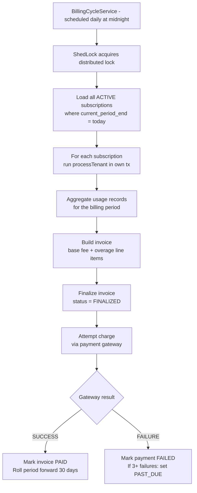

# Schemas & Flow Diagrams

## Entity-Relationship Diagram

## Invoice Lifecycle

## Subscription Lifecycle

## Payment Flow

## Billing Cycle Flow

Runs nightly via `@Scheduled`. Each subscription is processed in its own isolated transaction — a failure for one tenant does not affect others.

